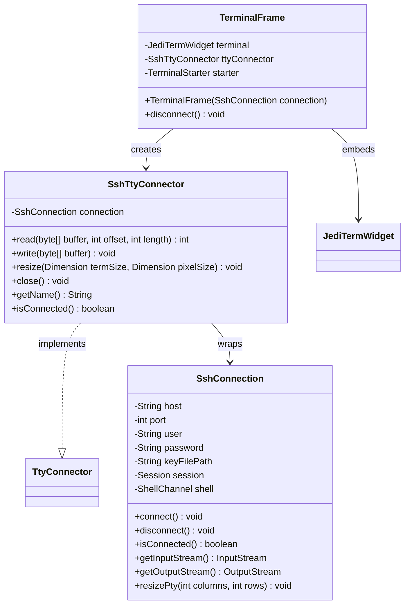
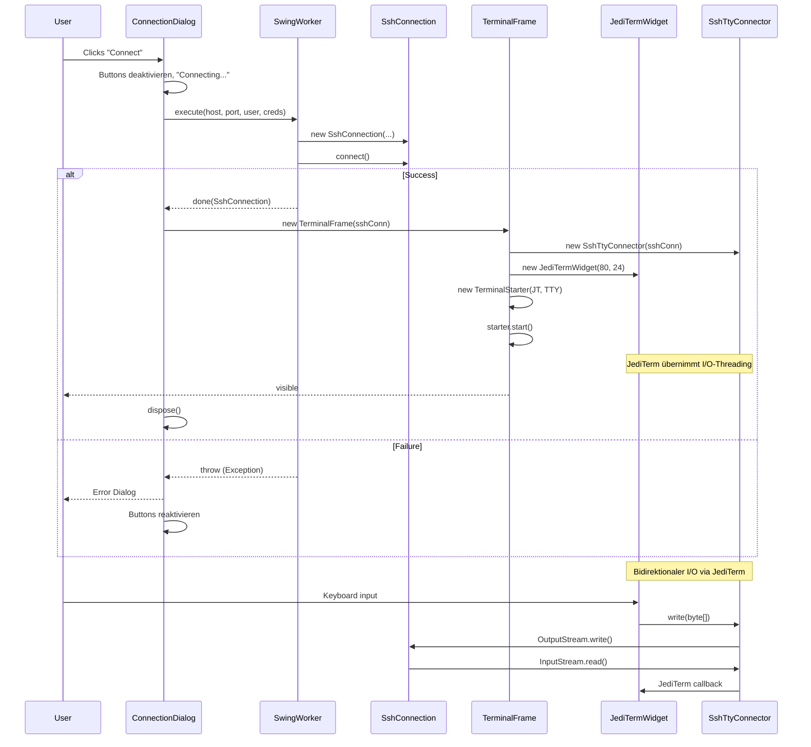

# Epic 3, Story 3.1: The Native Terminal ("PuTTY" alternative)

## Ziel

Ein funktionales SSH-Terminal innerhalb einer Swing-Oberfläche, das eine Shell-Channel-Verbindung via SSHJ herstellt und **JediTerm** als Terminal-Emulator nutzt.

---

## 1. Aktuelle Situation (Ist-Zustand)

- [`ConnectionDialog`](src/main/java/de/in/jnc/ConnectionDialog.java) sammelt SSH-Zugangsdaten (Host, Port, User, Passwort/Key)
- Der "Connect"-Button **loggt nur** und schließt den Dialog ([`onConnect()`](src/main/java/de/in/jnc/ConnectionDialog.java:248)) – es findet **keine** SSH-Verbindung statt
- SSHJ (`0.38.0`) ist bereits als Dependency in der [`pom.xml`](pom.xml:33) vorhanden
- Profile-Persistenz via JSON funktioniert ([`ProfileManager`](src/main/java/de/in/jnc/ProfileManager.java))
- Flat Package-Struktur unter [`de.in.jnc`](src/main/java/de/in/jnc/)

---

## 2. Soll-Konzept (Ziel-Architektur)

### 2.1 Warum JediTerm statt Eigenbau-ANSI-Parser?

| Aspekt | Eigenbau | JediTerm |
|--------|----------|----------|
| **ANSI-Unterstützung** | Minimal (SGR-Farben) | Vollständig (Cursor, Scrollregionen, 256-Farben, etc.) |
| **vim/nano/top** | Nicht nutzbar | Voll nutzbar |
| **Copy/Paste** | Selbst implementieren | Bereits integriert |
| **Scrollback** | Selbst implementieren | Bereits integriert |
| **Aufwand** | ~300-500 Zeilen Parser | ~50 Zeilen `TtyConnector` |
| **Lizenz** | Eigen | MIT – kompatibel |

JediTerm (von JetBrains, MIT-Lizenz) ist ein **reiner Java-Swing-Terminal-Emulator**, der als `JediTermWidget` direkt in jedes JPanel eingebettet werden kann.

### 2.2 Neue Klassen (im Sub-Package `de.in.jnc.terminal`)



#### [`SshConnection.java`](src/main/java/de/in/jnc/terminal/SshConnection.java)
- **Verantwortung:** Verbindungsaufbau, Session-Lifecycle, rohe I/O-Streams
- Authentifizierung: Passwort **oder** Private-Key (wie im ConnectionDialog konfiguriert)
- Öffnet einen `ShellChannel` mit PTY-Allokation (Termtyp `xterm-256color`, 80×24)
- Bietet `getInputStream()` / `getOutputStream()` für den TtyConnector
- `resizePty(columns, rows)` zur PTY-Größenanpassung
- Lifecycle: `connect()`, `disconnect()`, `isConnected()`

#### [`SshTtyConnector.java`](src/main/java/de/in/jnc/terminal/SshTtyConnector.java)
- **Verantwortung:** Implementiert JediTerms `TtyConnector`-Interface als Brücke zu SSHJ
- `read()` → liest vom `ShellChannel.getInputStream()`
- `write(byte[])` → schreibt in `ShellChannel.getOutputStream()`
- `resize()` → ruft `SshConnection.resizePty()` auf
- `close()` → ruft `SshConnection.disconnect()` auf
- Wird von JediTerms `TerminalStarter` automatisch in einem eigenen Reader-Thread betrieben

#### [`TerminalFrame.java`](src/main/java/de/in/jnc/terminal/TerminalFrame.java)
- **Verantwortung:** Fenster-Container für JediTerm
- Enthält ein `JediTermWidget` + `TerminalStarter` + `SshTtyConnector`
- Titel: `user@host:port – jNodeCommander`
- Window-Close-Listener → `SshTtyConnector.close()` → SSH trennen
- Starter-Aufruf: `terminalStarter.start()` beginnt das I/O-Handling

### 2.3 Integration in ConnectionDialog

- [`onConnect()`](src/main/java/de/in/jnc/ConnectionDialog.java:248) wird erweitert:
  1. **SwingWorker** startet Verbindungsaufbau im Hintergrund
  2. Dialog bleibt offen mit "Connecting..." (deaktivierte Buttons)
  3. Bei Erfolg: `TerminalFrame` öffnen, Dialog schließen
  4. Bei Fehler: `JOptionPane.showMessageDialog()` mit Fehlermeldung, Dialog wieder aktivieren

### 2.4 Datenfluss



### 2.5 Thread-Modell

| Thread | Aufgabe | Zuständig |
|--------|---------|-----------|
| **EDT** | UI-Updates, JediTerm-Rendering | `TerminalFrame`, `JediTermWidget` |
| **SwingWorker** | Verbindungsaufbau (blockierend) | `ConnectionDialog` |
| **JediTerm Reader** | Liest vom SSH-InputStream, liefert an JediTerm | `SshTtyConnector.read()` (von JediTerm gemanaged) |

JediTerm verwaltet seinen eigenen Reader-Thread intern – wir müssen uns darum nicht kümmern. Der `SshTtyConnector` wird von JediTerm aus dessen Reader-Thread aufgerufen.

### 2.6 Edge Cases & Fehlerbehandlung

| Fall | Verhalten |
|------|-----------|
| **Connection Timeout** | Fehlerdialog: "Connection timed out: host:port" |
| **Authentication Failure** | Fehlerdialog: "Authentication failed. Check password or key file." |
| **Key File ungültig** | Fehlerdialog: "Could not read private key from: path" |
| **Verbindungsabbruch während Session** | JediTerm zeigt "[closed]" im Terminal an |
| **Fenster wird geschlossen** | `SshTtyConnector.close()` → Session sauber beenden |
| **Mehrere Terminals** | Jedes Terminal bekommt eigene Instanzen aller Komponenten |
| **Terminal-Resize** | JediTerm ruft `SshTtyConnector.resize()` bei Fensteränderung auf → `ShellChannel.setPtySize()` |
| **Host-Key-Verifikation** | MVP: alle Host-Keys akzeptieren (`new HostKeyVerifier() { verify = true }`) |

---

## 3. Abhängigkeiten & Build

### Neue Dependency in [`pom.xml`](pom.xml)

```xml
<!-- JediTerm Terminal Emulator (MIT License) -->
<dependency>
    <groupId>com.jediterm</groupId>
    <artifactId>jediterm-terminal</artifactId>
    <version>3.1.0</version>
</dependency>
```

**Prüfung:** JediTerm benötigt keine natives Libraries – reines Java, plattformunabhängig.

### SSHJ ShellChannel-API (bereits vorhanden)

```java
SSHClient ssh = new SSHClient();
ssh.addHostKeyVerifier((host, port, key) -> true); // MVP: alle Keys akzeptieren
ssh.connect(host, port);
ssh.authPassword(user, password);
// oder: ssh.authPublickey(user, keyProvider);

Session session = ssh.startSession();
session.allocateDefaultPTY("xterm-256color", 80, 24, 0, 0);
ShellChannel shell = session.startShell();
```

---

## 4. Test-Strategie

### Unit-Tests (`src/test/java/de/in/jnc/terminal/`)

| Test-Klasse | Testet |
|-------------|--------|
| `SshConnectionTest` | Verbindungsaufbau mit gemockter SSHJ-Session (Mockito) |
| `SshTtyConnectorTest` | read/write/resize/close Delegation an SshConnection |
| `TerminalFrameTest` | Fenster-Titel, WindowClose → disconnect |

**Hinweis:** Echte SSH-Verbindungen werden **nicht** in Unit-Tests getestet. JediTerm selbst ist bereits von JetBrains getestet.

---

## 5. Implementierungs-Schritte

1. **Dependency hinzufügen:** `jediterm-terminal` in [`pom.xml`](pom.xml) eintragen

2. **Sub-Package erstellen:** Ordner `src/main/java/de/in/jnc/terminal/` anlegen

3. **[`SshConnection.java`](src/main/java/de/in/jnc/terminal/SshConnection.java) erstellen**
   - SSHJ-Verbindung mit Password + Key-Auth
   - ShellChannel mit PTY öffnen
   - getInputStream() / getOutputStream() bereitstellen
   - resizePty(columns, rows)
   - disconnect() mit Resource-Cleanup

4. **[`SshTtyConnector.java`](src/main/java/de/in/jnc/terminal/SshTtyConnector.java) erstellen**
   - Implementiert `com.jediterm.pty.TtyConnector`
   - read() → SshConnection.InputStream.read()
   - write(byte[]) → SshConnection.OutputStream.write()
   - resize() → SshConnection.resizePty()
   - close() → SshConnection.disconnect()

5. **[`TerminalFrame.java`](src/main/java/de/in/jnc/terminal/TerminalFrame.java) erstellen**
   - JFrame mit JediTermWidget + TerminalStarter + SshTtyConnector
   - Titel = user@host:port
   - Window-Close → disconnect
   - starter.start() nach der Initialisierung

6. **[`ConnectionDialog.onConnect()`](src/main/java/de/in/jnc/ConnectionDialog.java) erweitern**
   - SwingWorker für SSH-Verbindungsaufbau
   - "Connecting..."-Zustand im Dialog
   - Bei Erfolg: TerminalFrame öffnen
   - Bei Fehler: Error-Dialog

7. **Tests schreiben**
   - SshTtyConnectorTest (Delegation mocken)
   - TerminalFrameTest (Titel, Close-Verhalten)

8. **Integration & Smoke-Test**
   - Gegen echten SSH-Server testen
   - Prüfen: Login, ls, vim (startet), top (startet), Trennen, Resize
