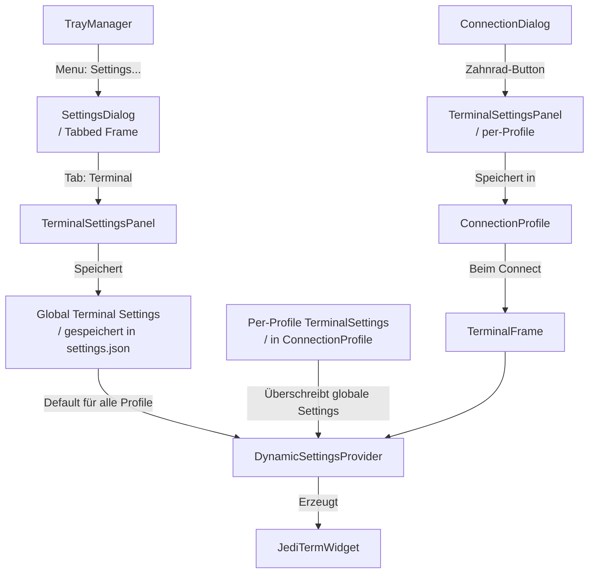
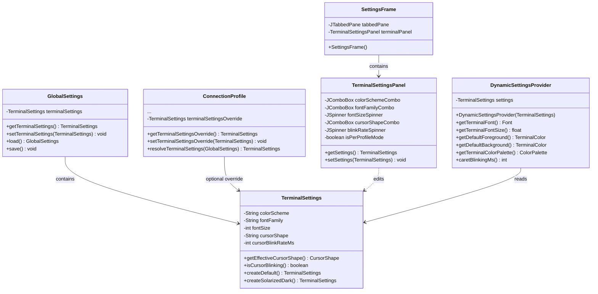
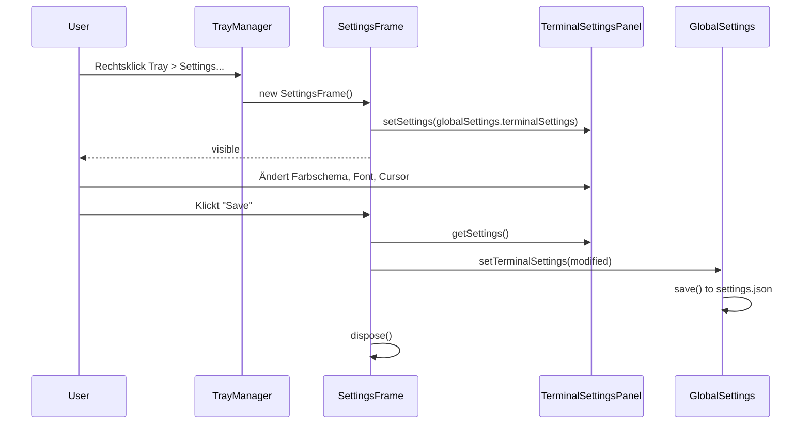
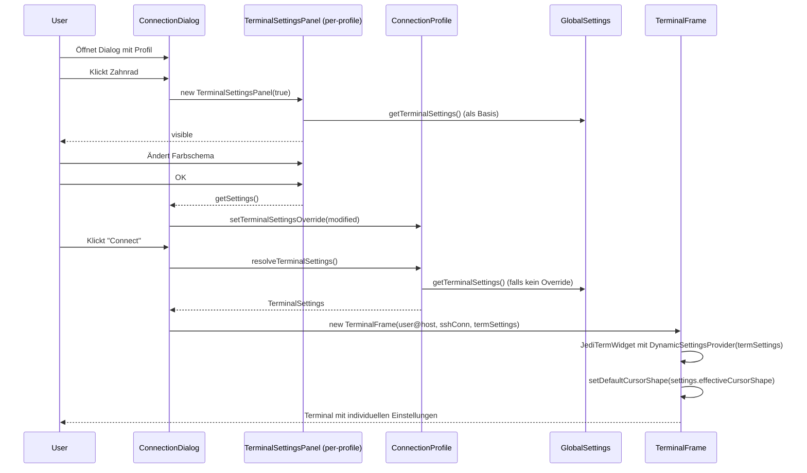

# Epic 3, Story 3.1a: Configurable Terminal Options

## Ziel

Terminal-Farben, Schriftart, Schriftgröße, Cursor-Stil und Cursor-Blinken konfigurierbar machen. Es gibt zwei Ebenen:

1. **Globale Settings** (via Tray-Menü "Settings") – Tabbed Dialog, ein Tab für Terminal
2. **Per-Profile-Override** (via Zahnrad-Button im [`ConnectionDialog`](src/main/java/de/in/jnc/ConnectionDialog.java)) – überschreibt globale Terminal-Einstellungen für ein bestimmtes Profil

---

## 1. Aktuelle Situation (Ist-Zustand)

- [`SolarizedDarkSettingsProvider`](src/main/java/de/in/jnc/terminal/SolarizedDarkSettingsProvider.java) extendet [`DefaultSettingsProvider`](libs/jediterm/ui/src/com/jediterm/terminal/ui/settings/DefaultSettingsProvider.java) und hat **alle Werte hartcodiert**
- [`TerminalFrame`](src/main/java/de/in/jnc/terminal/TerminalFrame.java:54) erzeugt `JediTermWidget` immer mit `new SolarizedDarkSettingsProvider()`
- [`ConnectionProfile`](src/main/java/de/in/jnc/ConnectionProfile.java) hat keine Terminal-spezifischen Felder
- [`TrayManager`](src/main/java/de/in/jnc/TrayManager.java) hat nur "Connection" und "Exit" – kein Settings-Eintrag
- **Keine globalen App-Einstellungen** vorhanden

---

## 2. Soll-Konzept (Ziel-Architektur)

### 2.1 Hierarchie der Settings



### 2.2 Klassen-Architektur



### 2.3 Neue/Klassendiagramm-Details

#### [`GlobalSettings`](src/main/java/de/in/jnc/GlobalSettings.java) – Globale App-Konfiguration

Singleton, persistiert als JSON in `%LOCALAPPDATA%/jNodeCommander/settings.json` (parallel zu `profiles.json`).

```java
public class GlobalSettings {
    private static final File SETTINGS_FILE = new File(AppEnv.getDataDir(), "settings.json");
    private static GlobalSettings instance;

    private TerminalSettings terminalSettings = TerminalSettings.createDefault();

    public static synchronized GlobalSettings getInstance() { ... }
    public TerminalSettings getTerminalSettings() { return terminalSettings; }
    public void setTerminalSettings(TerminalSettings s) { ... save(); }
    public void load() { ... } // JSON deserialisieren
    public void save() { ... } // JSON serialisieren
}
```

#### [`TerminalSettings`](src/main/java/de/in/jnc/terminal/TerminalSettings.java) – Terminal-Konfig-Daten

POJO für Jackson-Serialisierung. Enthält **keine** Logik außer Hilfsmethoden:

```java
public class TerminalSettings {
    public static final String SCHEME_SOLARIZED_DARK = "SOLARIZED_DARK";
    public static final String SCHEME_DEFAULT = "DEFAULT";
    public static final String SCHEME_CUSTOM = "CUSTOM";

    private String colorScheme = SCHEME_SOLARIZED_DARK;
    private String fontFamily = "";        // leer = OS-Default
    private int fontSize = 14;
    private String cursorShape = "BLINK_BLOCK";
    private int cursorBlinkRateMs = 505;

    // Für Custom-Scheme (optional MVP)
    private String customForeground;
    private String customBackground;

    public CursorShape getEffectiveCursorShape() {
        return CursorShape.valueOf(cursorShape);
    }
    public boolean isCursorBlinking() {
        return getEffectiveCursorShape().isBlinking();
    }

    public static TerminalSettings createDefault() { ... }
    public static TerminalSettings createSolarizedDark() { ... }
}
```

#### [`DynamicSettingsProvider`](src/main/java/de/in/jnc/terminal/DynamicSettingsProvider.java)

Ersetzt [`SolarizedDarkSettingsProvider`](src/main/java/de/in/jnc/terminal/SolarizedDarkSettingsProvider.java) (der für Referenz erhalten bleibt):

```java
public class DynamicSettingsProvider extends DefaultSettingsProvider {
    private final TerminalSettings settings;

    public DynamicSettingsProvider(TerminalSettings settings) { ... }

    @Override
    public Font getTerminalFont() {
        String fontName = settings.getFontFamily();
        if (fontName == null || fontName.isBlank()) {
            // OS-Default wie bisher
            fontName = isWindows() ? "Consolas" : isMacOS() ? "Menlo" : "Monospaced";
        }
        return new Font(fontName, Font.PLAIN, settings.getFontSize());
    }

    @Override
    public float getTerminalFontSize() { return settings.getFontSize(); }

    @Override
    public TerminalColor getDefaultForeground() {
        return switch (settings.getColorScheme()) {
            case SOLARIZED_DARK -> SolarizedPalette.DEFAULT_FOREGROUND;
            case DEFAULT -> TerminalColor.BLACK;
            case CUSTOM -> parseColor(settings.getCustomForeground());
        };
    }
    // ... analog für getDefaultBackground, getSelectionColor, etc.

    @Override
    public int caretBlinkingMs() { return settings.getCursorBlinkRateMs(); }
}
```

#### [`SolarizedPalette`](src/main/java/de/in/jnc/terminal/SolarizedPalette.java) – Farbkonstanten

Extrahiert aus dem alten `SolarizedDarkSettingsProvider`:

```java
public class SolarizedPalette {
    public static final TerminalColor BASE03  = TerminalColor.rgb(0x00, 0x2B, 0x36);
    public static final TerminalColor BASE02  = TerminalColor.rgb(0x07, 0x36, 0x42);
    public static final TerminalColor BASE0   = TerminalColor.rgb(0x83, 0x94, 0x96);
    // ... alle 16 Solarized-Farben

    public static final TerminalColor DEFAULT_FOREGROUND = BASE0;
    public static final TerminalColor DEFAULT_BACKGROUND = BASE03;
    // ...
}
```

#### [`SettingsFrame`](src/main/java/de/in/jnc/SettingsFrame.java) – Globaler Settings-Dialog

Ein `JFrame` (oder `JDialog`) mit `JTabbedPane`. Start enthält es nur den Tab "Terminal", später kommen weitere Tabs (z.B. "General", "Security") hinzu.

```java
public class SettingsFrame extends JFrame {
    private final TerminalSettingsPanel terminalPanel;

    public SettingsFrame() {
        setTitle("Settings – jNodeCommander");
        setDefaultCloseOperation(DISPOSE_ON_CLOSE);

        JTabbedPane tabs = new JTabbedPane();
        terminalPanel = new TerminalSettingsPanel(false); // false = global mode
        terminalPanel.setSettings(GlobalSettings.getInstance().getTerminalSettings());
        tabs.addTab("Terminal", terminalPanel);

        add(tabs, BorderLayout.CENTER);

        JButton saveBtn = new JButton("Save");
        saveBtn.addActionListener(e -> {
            GlobalSettings.getInstance().setTerminalSettings(terminalPanel.getSettings());
            dispose();
        });
        // ... OK/Cancel
    }
}
```

#### [`TerminalSettingsPanel`](src/main/java/de/in/jnc/terminal/TerminalSettingsPanel.java) – Wiederverwendbares UI-Panel

Ein `JPanel` mit allen Terminal-Steuerelementen. Kann in zwei Modi verwendet werden:

- **Global Mode** (`isPerProfileMode = false`): Zeigt "Use global settings" Checkbox nicht an
- **Per-Profile Mode** (`isPerProfileMode = true`): Zeigt "Use global settings" Checkbox an – wenn aktiviert, werden die Felder disabled

| UI-Element | Typ | Werte |
|-----------|-----|-------|
| Farbschema | `JComboBox<String>` | Solarized Dark, Default, Custom |
| Schriftart | `JComboBox<String>` | System-Schriften + "System Default" |
| Schriftgröße | `JSpinner` | 8–36, Schritt 1 |
| Cursor-Stil | `JComboBox<String>` | Block (blinkend), Block (statisch), Unterstrich (blinkend), ... |
| Blinkrate | `JSpinner` | 0–2000ms, Schritt 50 |

#### [`ConnectionProfile.resolveTerminalSettings()`](src/main/java/de/in/jnc/ConnectionProfile.java)

Neue Methode, die die finale `TerminalSettings` für ein Profil ermittelt:

```java
public TerminalSettings resolveTerminalSettings() {
    if (terminalSettingsOverride != null) {
        return terminalSettingsOverride;
    }
    return GlobalSettings.getInstance().getTerminalSettings();
}
```

### 2.4 Integration in TrayManager

```java
// In TrayManager.createPopupMenu(), zwischen Connection-Menu und Exit:
MenuItem settingsItem = new MenuItem("Settings...");
settingsItem.addActionListener(e -> {
    SwingUtilities.invokeLater(() -> {
        new SettingsFrame().setVisible(true);
    });
});
popup.add(settingsItem);
popup.addSeparator();
```

### 2.5 Integration in ConnectionDialog

- Zahnrad-Button (`⚙` oder `FlatSVGIcon`) neben dem Save-Button
- Beim Klick: `TerminalSettingsPanel` in einem eigenen kleinen Dialog anzeigen (oder inline im ConnectionDialog?)
- Beim Speichern: `profile.setTerminalSettingsOverride(terminalPanel.getSettings())`
- Wenn `terminalSettingsOverride == null` → Profil verwendet globale Einstellungen

```java
// ConnectionDialog – neuer Button
JButton gearBtn = new JButton(new FlatSVGIcon("gear.svg", 16, 16));
gearBtn.setToolTipText("Terminal Settings für dieses Profil");
gearBtn.addActionListener(e -> onTerminalSettings());

private void onTerminalSettings() {
    TerminalSettings current = (loadedProfileId != null && profile.getTerminalSettingsOverride() != null)
        ? profile.getTerminalSettingsOverride()
        : GlobalSettings.getInstance().getTerminalSettings();

    TerminalSettingsPanel panel = new TerminalSettingsPanel(true); // per-profile mode
    panel.setSettings(current);

    int result = JOptionPane.showConfirmDialog(this, panel,
        "Terminal Settings – " + userField.getText() + "@" + hostField.getText(),
        JOptionPane.OK_CANCEL_OPTION, JOptionPane.PLAIN_MESSAGE);

    if (result == JOptionPane.OK_OPTION) {
        TerminalSettings newSettings = panel.getSettings();
        // Nur speichern, wenn sie von global abweichen
        if (!newSettings.equals(GlobalSettings.getInstance().getTerminalSettings())) {
            // Profil muss existieren
            if (loadedProfileId != null) {
                profile.setTerminalSettingsOverride(newSettings);
            }
        }
    }
}
```

### 2.6 Änderungen an TerminalFrame

```java
public TerminalFrame(String title, SshConnection sshConnection, TerminalSettings settings) {
    // ...
    terminalWidget = new JediTermWidget(DEFAULT_COLUMNS, DEFAULT_ROWS,
            new DynamicSettingsProvider(settings));
    add(terminalWidget, BorderLayout.CENTER);
    ttyConnector = new SshTtyConnector(sshConnection);
    terminalWidget.setTtyConnector(ttyConnector);
    terminalWidget.getTerminalPanel().setDefaultCursorShape(settings.getEffectiveCursorShape());
    // ...
}
```

```java
// Im ConnectionDialog.onConnect():
TerminalSettings termSettings = profile != null
    ? profile.resolveTerminalSettings()
    : GlobalSettings.getInstance().getTerminalSettings();
TerminalFrame terminalFrame = new TerminalFrame(user + "@" + host, sshConnection, termSettings);
```

---

## 3. Datenfluss

### Global Settings speichern



### Per-Profile Override + Connect



---

## 4. Änderungen im Überblick

| Datei | Änderung | Status |
|-------|----------|--------|
| `src/main/java/de/in/jnc/terminal/TerminalSettings.java` | **NEU** – Datenmodell für Terminal-Konfiguration | Neu |
| `src/main/java/de/in/jnc/terminal/DynamicSettingsProvider.java` | **NEU** – Dynamischer SettingsProvider basierend auf TerminalSettings | Neu |
| `src/main/java/de/in/jnc/terminal/SolarizedPalette.java` | **NEU** – Farbkonstanten aus SolarizedDarkSettingsProvider extrahiert | Neu |
| `src/main/java/de/in/jnc/terminal/TerminalSettingsPanel.java` | **NEU** – Wiederverwendbares UI-Panel (global + per-profile) | Neu |
| `src/main/java/de/in/jnc/GlobalSettings.java` | **NEU** – Singleton für globale App-Konfiguration | Neu |
| `src/main/java/de/in/jnc/SettingsFrame.java` | **NEU** – Tabbed Settings-Dialog (via Tray-Menü) | Neu |
| `src/main/java/de/in/jnc/ConnectionProfile.java` | **ÄNDERN** – Feld `terminalSettingsOverride` + `resolveTerminalSettings()` | Geändert |
| `src/main/java/de/in/jnc/terminal/TerminalFrame.java` | **ÄNDERN** – Konstruktor-Parameter für TerminalSettings, DynamicSettingsProvider | Geändert |
| `src/main/java/de/in/jnc/ConnectionDialog.java` | **ÄNDERN** – Zahnrad-Button für per-Profile Terminal-Settings | Geändert |
| `src/main/java/de/in/jnc/TrayManager.java` | **ÄNDERN** – "Settings..." MenuItem hinzufügen | Geändert |
| `src/main/java/de/in/jnc/terminal/SolarizedDarkSettingsProvider.java` | **UNVERÄNDERT** (als Referenz erhalten) | Besteht |

---

## 5. Test-Strategie

### Unit-Tests (`src/test/java/de/in/jnc/terminal/`)

| Test-Klasse | Testet |
|-------------|--------|
| `TerminalSettingsTest` | Default-Werte, CursorShape-Konvertierung, JSON-Serialisierung, Equals |
| `DynamicSettingsProviderTest` | Farben/Font/Cursor abhängig von TerminalSettings |
| `GlobalSettingsTest` | Speichern/Laden von settings.json |

### Manuelle Tests

- Tray-Menü → Settings → Terminal-Tab → Werte ändern → Save
- ConnectionDialog → Zahnrad → Werte ändern → OK → Connect → Terminal zeigt angepasste Werte
- Per-Profile Override auf "use global" zurücksetzen → Terminal nutzt wieder globale Settings

---

## 6. Implementierungs-Reihenfolge

1. **[`TerminalSettings`](src/main/java/de/in/jnc/terminal/TerminalSettings.java) erstellen** – POJO mit Feldern, Hilfsmethoden, Factory-Methoden, Unit-Test
2. **[`SolarizedPalette`](src/main/java/de/in/jnc/terminal/SolarizedPalette.java) erstellen** – Farbkonstanten aus dem alten Provider extrahieren
3. **[`DynamicSettingsProvider`](src/main/java/de/in/jnc/terminal/DynamicSettingsProvider.java) erstellen** – Dynamische SettingsProvider-Implementierung, Unit-Test
4. **[`GlobalSettings`](src/main/java/de/in/jnc/GlobalSettings.java) erstellen** – Singleton mit JSON-Persistenz, Unit-Test
5. **[`ConnectionProfile`](src/main/java/de/in/jnc/ConnectionProfile.java) erweitern** – Feld `terminalSettingsOverride` + `resolveTerminalSettings()`
6. **[`TerminalSettingsPanel`](src/main/java/de/in/jnc/terminal/TerminalSettingsPanel.java) erstellen** – Wiederverwendbares UI-Panel
7. **[`SettingsFrame`](src/main/java/de/in/jnc/SettingsFrame.java) erstellen** – Tabbed Frame mit Terminal-Tab
8. **[`TrayManager`](src/main/java/de/in/jnc/TrayManager.java) anpassen** – "Settings..." MenuItem
9. **[`TerminalFrame`](src/main/java/de/in/jnc/terminal/TerminalFrame.java) anpassen** – DynamicSettingsProvider + Cursor-Shape
10. **[`ConnectionDialog`](src/main/java/de/in/jnc/ConnectionDialog.java) anpassen** – Zahnrad-Button + per-Profile Override
11. **Integration & Smoke-Test**

---

## 7. Offene Fragen

1. **SettingsFrame als JFrame oder JDialog?** – Als `JFrame` (nicht-modal) damit man Einstellungen ändern kann während ein Terminal läuft
2. **Custom-Farbschema im MVP?** – Vorschlag: JA, aber nur Vordergrund + Hintergrund als Hex-Color-Felder (die ANSI-16-Palette folgt in einem späteren Schritt)
3. **Icons für den Settings-Tab?** – Können wir mit FlatSVGIcon und vorhandenen SVGs umsetzen

---

## 8. Abgrenzung (Nicht Teil dieser Story)

- Keine anderen Settings-Tabs (General, Security, etc.) – nur Platzhalter im TabbedPane
- Keine ANSI-Farbpaletten-Editierung für Custom-Schemas
- Kein Theme-System für die gesamte App (nur Terminal)
- Kein Terminal-Tab-System (kommt in Epic 4)
