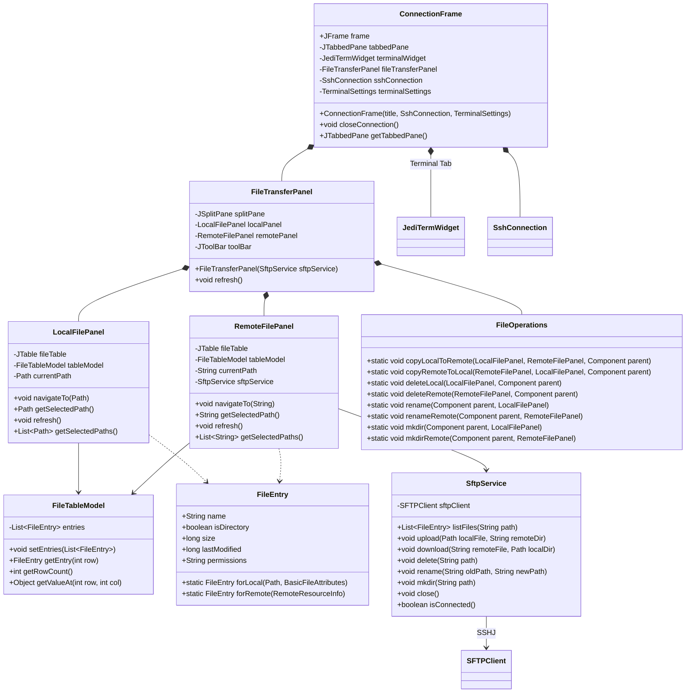
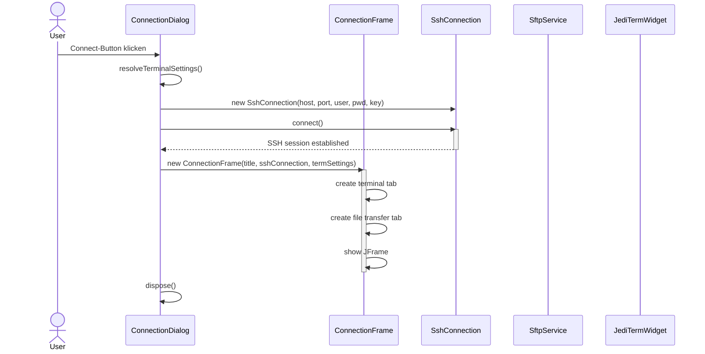
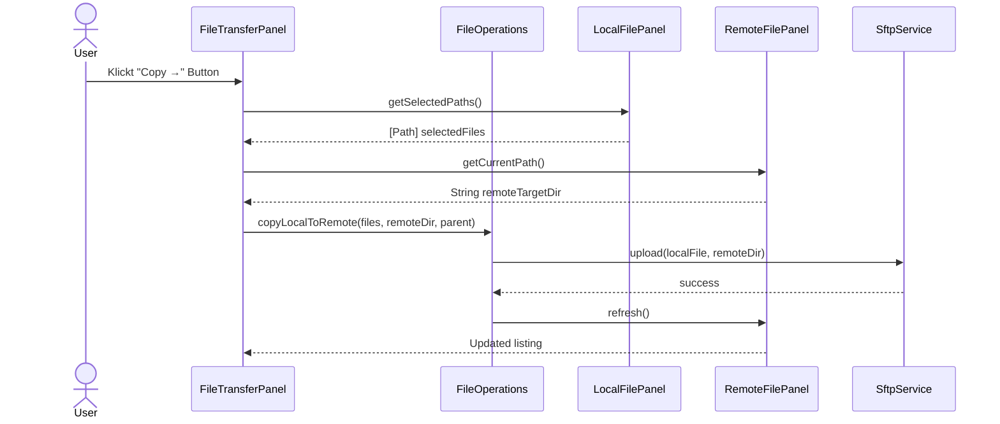

# Story 3.2: File Transfer Interface — Überarbeiteter Plan

## Architektur-Entscheidung (vom User vorgegeben)

### ❌ Bisher (alt)
```
TerminalFrame (JFrame)           — nur ein Tab möglich, kein File-Transfer
  └─ JediTermWidget              — nur Terminal
```

### ✅ Neu: `ConnectionFrame` als Container
```
ConnectionFrame (JFrame)
  └─ JTabbedPane
       ├─ [🖥️ Terminal]          — pinned, nicht schließbar
       │    └─ JediTermWidget
       ├─ [📁 File Transfer]      — pinned, nicht schließbar
       │    └─ JSplitPane
       │         ├─ LocalFilePanel
       │         └─ RemoteFilePanel
       └─ [🌐 Browser]            — Future, ggf. schließbar
            └─ JCEF Browser
```

- **Mehrere parallele `ConnectionFrame`**-Instanzen (jede mit eigener SSH-Verbindung)
- Pinned Tabs können nicht geschlossen werden
- Jeder `ConnectionFrame` besitzt seine eigene `SshConnection`

---

## Refactoring: TerminalFrame → ConnectionFrame

Bisher erbt [`TerminalFrame`](src/main/java/de/in/jnc/terminal/TerminalFrame.java) von `JFrame` und enthält nur das Terminal. Dies wird ersetzt durch:

### Neue Klasse: `ConnectionFrame`
```java
public class ConnectionFrame extends JFrame {
    private final JTabbedPane tabbedPane;
    private final SshConnection sshConnection;

    // Tabs
    private final JediTermWidget terminalWidget;
    private final FileTransferPanel fileTransferPanel;

    // Konstruktor: startet SSH, erstellt Terminal + File-Transfer
    public ConnectionFrame(String title, SshConnection sshConnection, TerminalSettings settings)
```

### Tab-Icons
- Terminal: Nutze vorhandenes [`jnc.svg`](src/main/resources/jnc.svg) oder `terminal.svg` (neu)
- File Transfer: `folder.svg` (neu) oder `gear.svg` (ungenau) — besser ein neues Icon

---

## Erweiterte Architektur



### Datenfluss: Verbindungsaufbau



### Datenfluss: File-Operation (Kopieren Lokal → Remote)



---

## Dateistruktur (neue + geänderte Dateien)

### Neue Dateien in `src/main/java/de/in/jnc/connection/`

| Datei | Zweck |
|-------|-------|
| [`ConnectionFrame.java`](src/main/java/de/in/jnc/connection/ConnectionFrame.java) | JFrame mit JTabbedPane (Terminal + File-Transfer) |
| [`filetransfer/FileTransferPanel.java`](src/main/java/de/in/jnc/connection/filetransfer/FileTransferPanel.java) | Dual-Panel inkl. Toolbar mit Copy/Move/Delete |
| [`filetransfer/LocalFilePanel.java`](src/main/java/de/in/jnc/connection/filetransfer/LocalFilePanel.java) | JTable für lokales Dateisystem |
| [`filetransfer/RemoteFilePanel.java`](src/main/java/de/in/jnc/connection/filetransfer/RemoteFilePanel.java) | JTable für remote (SFTP) Dateisystem |
| [`filetransfer/FileTableModel.java`](src/main/java/de/in/jnc/connection/filetransfer/FileTableModel.java) | TableModel für beide Panels |
| [`filetransfer/FileEntry.java`](src/main/java/de/in/jnc/connection/filetransfer/FileEntry.java) | Datenklasse für Datei/Verzeichnis |
| [`filetransfer/FileOperations.java`](src/main/java/de/in/jnc/connection/filetransfer/FileOperations.java) | Copy, Move, Delete, Rename, MkDir |
| [`filetransfer/SftpService.java`](src/main/java/de/in/jnc/connection/filetransfer/SftpService.java) | SFTP-Client-Wrapper (SSHJ) |

### Neue Icons in `src/main/resources/`

| Datei | Zweck |
|-------|-------|
| `terminal.svg` | Icon für den Terminal-Tab |
| `folder.svg` | Icon für den File-Transfer-Tab |
| `folder-open.svg` | Icon für geöffnetes Verzeichnis (optional) |

### Geänderte Dateien

| Datei | Änderung |
|-------|----------|
| [`TerminalFrame.java`](src/main/java/de/in/jnc/terminal/TerminalFrame.java) | ❌ **Wird ersetzt** durch `ConnectionFrame` — kann gelöscht werden |
| [`ConnectionDialog.java`](src/main/java/de/in/jnc/ConnectionDialog.java) | Erzeugt `ConnectionFrame` statt `TerminalFrame` |
| [`TrayManager.java`](src/main/java/de/in/jnc/TrayManager.java) | Keine Änderung (öffnet weiterhin ConnectionDialog) |
| [`SshConnection.java`](src/main/java/de/in/jnc/terminal/SshConnection.java) | Neue Methode: `SFTPClient getSFTPClient()` |
| [`pom.xml`](pom.xml) | Keine neuen Dependencies |

---

## UI-Design: ConnectionFrame

```
┌──────────────────────────────────────────────────────┐
| [🖥️ Terminal] [📁 File Transfer]                     │  ← JTabbedPane
├──────────────────────────────────────────────────────┤
│                                                        │
│  (Tab-Inhalt, z.B. Terminal oder File-Transfer)        │
│                                                        │
└──────────────────────────────────────────────────────┘
┌──────────────────────────────────────────────────────┐
| 📁 File Transfer                                      │
├──────────────────────────────────────────────────────┤
│ [F5:Copy →] [F6:Move →] [F7:MkDir] [F8:Del] [F3:View]│
├────────────────────────┬─────────────────────────────┤
│  Lokal: C:\Users\...   │  Remote: /home/user/        │
│ ┌────────────────────┐ │ ┌──────────────────────────┐ │
│ │  ..           DIR   │ │ │  ..                 DIR  │ │
│ │  documents    DIR   │ │ │  projects           DIR  │ │
│ │  file1.txt    2.3k  │ │ │  file1.txt         2.3k  │ │
│ │  file2.pdf     14M  │ │ │  script.sh          512  │ │
│ │  image.png    350k  │ │ │                      │ │
│ └────────────────────┘ │ └──────────────────────────┘ │
├────────────────────────┴─────────────────────────────┤
│  Bereit                                               │
└──────────────────────────────────────────────────────┘
```

---

## Tabs: Verhalten

| Tab | Icon | Schließbar | Inhalt |
|-----|------|------------|--------|
| Terminal | 🖥️ `terminal.svg` | ❌ Nein (pinned) | JediTermWidget |
| File Transfer | 📁 `folder.svg` | ❌ Nein (pinned) | FileTransferPanel |
| Browser (Future) | 🌐 (Browser-Icon) | Ja/Nein? | JCEF Browser |

Technische Umsetzung: `JTabbedPane` hat keine native "pinned" API. Wir realisieren das über:
- Keinen Close-Button für Tab 0 und 1
- `JTabbedPane` + Override von `MouseListener` um Close-Request zu blockieren
- Oder: Eigener Tab-Component-Renderer der Close-Button nur für bestimmte Tabs zeigt

---

## Implementierungs-Reihenfolge (Story 3.1 + 3.2 kombiniert)

### Schritt 1: `SftpService` und `SshConnection`-Erweiterung
1. [`SshConnection.java`](src/main/java/de/in/jnc/terminal/SshConnection.java) — Methode `getSFTPClient()` hinzufügen
2. [`SftpService.java`](src/main/java/de/in/jnc/connection/filetransfer/SftpService.java) — Wrap SSHJ SFTPClient
3. [`FileEntry.java`](src/main/java/de/in/jnc/connection/filetransfer/FileEntry.java) — Datenklasse

### Schritt 2: `FileTransferPanel`-Komponenten
4. [`FileTableModel.java`](src/main/java/de/in/jnc/connection/filetransfer/FileTableModel.java)
5. [`LocalFilePanel.java`](src/main/java/de/in/jnc/connection/filetransfer/LocalFilePanel.java)
6. [`RemoteFilePanel.java`](src/main/java/de/in/jnc/connection/filetransfer/RemoteFilePanel.java)
7. [`FileOperations.java`](src/main/java/de/in/jnc/connection/filetransfer/FileOperations.java)
8. [`FileTransferPanel.java`](src/main/java/de/in/jnc/connection/filetransfer/FileTransferPanel.java)

### Schritt 3: `ConnectionFrame` (ersetzt TerminalFrame)
9. [`ConnectionFrame.java`](src/main/java/de/in/jnc/connection/ConnectionFrame.java) — JTabbedPane mit Terminal + File-Transfer
10. Icons: `terminal.svg`, `folder.svg`

### Schritt 4: Integration
11. [`ConnectionDialog.java`](src/main/java/de/in/jnc/ConnectionDialog.java) — `TerminalFrame` → `ConnectionFrame`
12. [`TerminalFrame.java`](src/main/java/de/in/jnc/terminal/TerminalFrame.java) — entfernen (durch ConnectionFrame ersetzt)

### Schritt 5: Tests
13. Unit-Tests für `SftpService`, `FileEntry`, `FileTableModel`
14. Manueller Integrationstest

---

## Abhängigkeiten

| Dependency | Status | Begründung |
|------------|--------|------------|
| SSHJ 0.38.0 | ✅ Bereits vorhanden | `SFTPClient` für alle Remote-File-Operationen |
| java.nio.file | ✅ JDK Built-in | Lokale File-Operationen |
| Swing (JTable, JSplitPane, JTabbedPane) | ✅ JDK Built-in | UI-Komponenten |
| FlatLaf | ✅ Bereits vorhanden | Look & Feel |
| Cuberact Layout | ✅ Bereits vorhanden | Für Toolbar-Layout |

**Keine neuen Dependencies erforderlich!**
