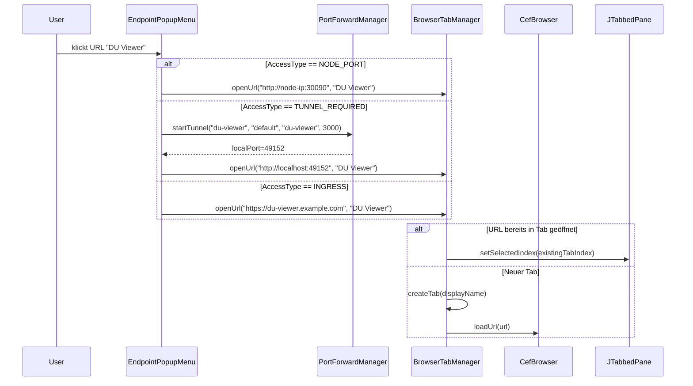

# Epic 3 – Story 3.3: Browser Integration & Service Discovery

## Übersicht

Zwei zusammenhängende Stories, die Web-Browser-Funktionalität in jnc bringen:

1. **Story 3.3.1 – Browser Tab** (JCEF-Embedding)
2. **Story 3.3.2 – URL + Service Discovery** (K8s-Endpoints automatisch erkennen)

---

## Story 3.3.1: Browser Tab

### Ziel

Einen vollwertigen Chromium-basierten Browser-Tab in ConnectionFrame einbetten, der:
- Beliebige URLs rendern kann
- Eine Adressleiste besitzt
- Mehrfach geöffnet werden kann (pro URL ein Tab)
- Tabs wiedererkennt: Klick auf bereits geöffnete URL → Tab selektieren, nicht duplizieren
- JS-Injection-fähig ist (Vorbereitung für Epic 4)

### Architektur

```
┌──────────────────────────────────────────────────────────┐
│ ConnectionFrame (JFrame)                                  │
│  ┌──────────────────────────────────────────────────────┐ │
│  │ TabBar: [Terminal] [File Transfer] [Keycloak] [+]   │ │
│  ├──────────────────────────────────────────────────────┤ │
│  │ BrowserPanel (bei aktivem Browser-Tab)               │ │
│  │  ┌─[🔗 https://keycloak.example.com ][⏎]───────┐   │ │
│  │  │                                                  │   │
│  │  │  CefBrowser (JCEF – Chromium Embedded)          │   │
│  │  │                                                  │   │
│  │  └──────────────────────────────────────────────────┘   │
│ ──────────────────────────────────────────────────────────  │
│ Status: "https://keycloak.example.com – Connected"         │
└──────────────────────────────────────────────────────────┘
```

### Neue Klassen

| Klasse | Package | Beschreibung |
|--------|---------|--------------|
| **`BrowserPanel`** | `de.in.jnc.connection.browser` | JPanel mit JCEF-Browser + URL-Leiste + Lade-Indikator |
| **`BrowserTabManager`** | `de.in.jnc.connection` | Verwaltet Browser-Tabs: öffnen, selektieren, schließen, URL-Tab-Map |
| **`CefBrowserFactory`** | `de.in.jnc.connection.browser` | Initialisiert JCEF (CefApp) einmalig, erzeugt CefBrowser-Instanzen |

### BrowserPanel – Komponenten

```
┌────────────────────────────────────────────────────┐
│ JPanel (BorderLayout)                              │
│                                                     │
│ ┌─North──────────────────────────────────────────┐ │
│ │ JToolBar (URL-Leiste)                          │ │
│ │ [←] [→] [↻] [🔗 URL-Feld  ][⏎]               │ │
│ └────────────────────────────────────────────────┘ │
│ ┌─Center─────────────────────────────────────────┐ │
│ │ CefBrowser (Chromium)                          │ │
│ │                                                 │ │
│ └────────────────────────────────────────────────┘ │
│ ┌─South──────────────────────────────────────────┐ │
│ │ Statusleiste (optional)                        │ │
│ └────────────────────────────────────────────────┘ │
└────────────────────────────────────────────────────┘
```

### BrowserTabManager – Tab-Logik

```java
public class BrowserTabManager {
    private final JTabbedPane tabbedPane;
    private final Map<String, Integer> urlToTabIndex; // URL → Tab-Index

    /**
     * Öffnet eine URL in einem Browser-Tab.
     * Wenn die URL bereits in einem existierenden Tab geöffnet ist,
     * wird dieser Tab selektiert (kein Duplikat).
     * Sonst wird ein neuer Tab erzeugt.
     */
    public void openUrl(String url, String displayName);

    /**
     * Erzwingt einen NEUEN leeren Browser-Tab (für "New Browser Tab"-Menüeintrag).
     */
    public void openNewTab();

    /**
     * Schließt einen Browser-Tab und räumt Ressourcen auf.
     */
    public void closeTab(int tabIndex);
}
```

### JCEF-Initialisierung

Einmalig beim Start (oder beim ersten Browser-Tab): Download + Setup von JCEF via `jcefmaven`.

```java
public class CefBrowserFactory {
    private static boolean initialized = false;

    public static synchronized void initialize() {
        if (initialized) return;
        // jcefmaven lädt native Binaries automatisch herunter
        CefApp.startup();
        var settings = new CefSettings();
        settings.windowless_rendering_enabled = false; // offscreen-rendering deaktiviert
        CefApp.getInstance(settings);
        initialized = true;
    }

    public static CefBrowser createBrowser() {
        initialize();
        return CefBrowserBuilder
            .createBuilder()
            .build();
    }
}
```

### Dependency

Ist bereits in pom.xml vorhanden:
```xml
<dependency>
    <groupId>me.friwi</groupId>
    <artifactId>jcefmaven</artifactId>
    <version>146.0.10</version>
</dependency>
```

---

## Story 3.3.2: URL + Service Discovery

### Ziel

Automatisch HTTP-Endpoints auf dem verbundenen K8s-Cluster erkennen und im "Web Apps"-Menü anzeigen, gruppiert nach Erreichbarkeit.

### Automatische Darstellungsumschaltung

Die Darstellung schaltet automatisch um, basierend auf der **Anzahl der Namespaces** mit gefundenen Web-Services:

| Namespaces | Default-Ansicht | Begründung |
|------------|----------------|------------|
| 1 | Flat (AccessType) | Nur ein Namespace → keine Hierarchie nötig |
| 2 | Flat (AccessType) | master + ein weiterer → flach überschaubar |
| 3+ | Gruppiert (Namespace) | Viele Namespaces → Gruppierung nötig |

Zusätzlich gibt es im Popup einen **Toggle-Schalter** `☑ Group by Namespace`, mit dem der User manuell zwischen Flat und Gruppiert umschalten kann. Bei <=2 Namespaces ist der Toggle deaktiviert (grau).

### Flat-Ansicht (1-2 Namespaces, oder manuell umgeschaltet)

```
┌──────────────────────────────────────────────────────┐
│  🔍 New Browser Tab                 (immer neuer Tab) │
│ ──────────────────────────────────────────────────── │
│  📡 NodePort (direkt erreichbar)                     │
│    ├─ 🔗 Keycloak         master    :31080           │
│    ├─ 🔗 DicomServices    team-a   :32090            │
│    └─ 🔗 Monitoring       master    :30090           │
│ ──────────────────────────────────────────────────── │
│  🚇 Tunnel erforderlich (port-forward)               │
│    ├─ 🔗 DU Viewer        team-a   :3000             │
│    ├─ 🔗 ConfigServices   team-b   :8081             │
│    └─ 🔗 DU API           team-b   :8443             │
│ ──────────────────────────────────────────────────── │
│  🔄 Neu laden                                        │
└──────────────────────────────────────────────────────┘
```

*In der Flat-Ansicht wird der Namespace als sekundäre Info hinter dem Service-Namen angezeigt.*

### Gruppiert-Ansicht (3+ Namespaces, oder manuell umgeschaltet)

```
┌──────────────────────────────────────────────────────┐
│  🔍 New Browser Tab                 (immer neuer Tab) │
│ ──────────────────────────────────────────────────── │
│  📦 master                                            │
│    ├─ 📡 NodePort                                     │
│    │   └─ 🔗 Keycloak              :31080             │
│    └─ 🚇 Tunnel                                       │
│        └─ 🔗 Monitoring            :49001             │
│  📦 team-alpha                                         │
│    ├─ 📡 NodePort                                     │
│    │   └─ 🔗 DicomServices         :32090             │
│    └─ 🚇 Tunnel                                       │
│        └─ 🔗 DU Viewer             :49002             │
│  📦 team-beta                                          │
│    └─ 🚇 Tunnel                                       │
│        └─ 🔗 DU API                :49003             │
│ ──────────────────────────────────────────────────── │
│  ☑ Group by Namespace  │  🔄 Neu laden               │
└──────────────────────────────────────────────────────┘
```

### Neue Klassen

| Klasse | Package | Beschreibung |
|--------|---------|--------------|
| **`SshCommandExecutor`** | `de.in.jnc.terminal` | Führt SSH-Kommandos in separatem Session-Channel aus, liefert stdout |
| **`K8sEndpointDiscoverer`** | `de.in.jnc.connection.browser` | Ruft kubectl-Befehle ab, parst Antwort |
| **`Endpoint`** (Record) | `de.in.jnc.connection.browser` | `String displayName, String url, int port, AccessType accessType` |
| **`AccessType`** (Enum) | `de.in.jnc.connection.browser` | `NODE_PORT, TUNNEL_REQUIRED, INGRESS` |
| **`EndpointPopupMenu`** | `de.in.jnc.connection.browser` | Das gruppierte JPopupMenu |
| **`PortForwardManager`** | `de.in.jnc.connection.browser` | Verwalte `kubectl port-forward`-Prozesse (start/stop) |

### SshCommandExecutor

Ergänzung an [`SshConnection`](src/main/java/de/in/jnc/terminal/SshConnection.java:29):

```java
/**
 * Führt ein Shell-Kommando auf dem Remote-Host aus.
 * Nutzt einen SEPARATEN Session-Channel (parallel zur laufenden Shell).
 *
 * @param command das auszuführende Kommando
 * @return stdout des Kommandos
 * @throws IOException bei Fehlern
 */
public String executeCommand(String command) throws IOException {
    Session cmdSession = sshClient.startSession();
    try {
        Command cmd = cmdSession.exec(command);
        String output = new String(cmd.getInputStream().readAllBytes(), StandardCharsets.UTF_8);
        cmd.join(10, TimeUnit.SECONDS);
        return output.trim();
    } finally {
        cmdSession.close();
    }
}
```

### Endpoint-Record (erweitert um namespace)

```java
public record Endpoint(
    String displayName,    // "Keycloak"
    String url,            // "http://10.0.0.1:31080"
    int port,              // 31080
    AccessType accessType, // NODE_PORT / TUNNEL_REQUIRED / INGRESS
    String namespace       // "master"
) {}
```

### K8sEndpointDiscoverer – Discovery-Logik

```java
public class K8sEndpointDiscoverer {

    /**
     * Entdeckt HTTP-Endpoints auf dem Cluster via kubectl.
     *
     * 1. kubectl get svc --all-namespaces -o json → alle Services
     * 2. Filtere auf Web-Ports (80, 443, 3000, 5000, 8080-9090)
     * 3. Klassifiziere nach AccessType:
     *    - Type==NodePort → NODE_PORT
     *    - Type==LoadBalancer → INGRESS (via LB-Hostname)
     *    - Type==ClusterIP → TUNNEL_REQUIRED
     *    - Ingress-Ressourcen vorhanden → INGRESS (via Hostname)
     * 4. Zähle unique Namespaces → Entscheide Default-Ansicht
     * 5. Gruppiere nach Namespace (bei 3+) oder AccessType (bei <=2)
     */
    public List<Endpoint> discover(SshCommandExecutor executor) throws IOException;

    /**
     * Parst kubectl JSON-Output in Endpoint-Objekte.
     * package-private für Tests.
     */
    List<Endpoint> parseServices(String jsonOutput);

    /**
     * Gibt die Anzahl der unique Namespaces im letzten Discovery-Durchlauf zurück.
     */
    int getNamespaceCount();
}
```

### Port-Forward-Manager

```java
public class PortForwardManager {
    private final Map<String, Process> activeTunnels; // endpointId → Process

    /**
     * Startet kubectl port-forward im Hintergrund.
     * Gibt den lokalen Port zurück.
     */
    public int startTunnel(String endpointId, String namespace, String serviceName, int remotePort);

    /**
     * Stoppt einen Tunnel.
     */
    public void stopTunnel(String endpointId);

    /**
     * Stoppt ALLE Tunnel (beim Connection-Close).
     */
    public void stopAll();
}
```

### EndpointPopupMenu – Darstellungslogik

```java
public class EndpointPopupMenu extends JPopupMenu {

    /**
     * Baut das Menü dynamisch auf.
     *
     * @param endpoints     entdeckte Endpoints
     * @param groupByNs     true = Namespace-Gruppierung, false = AccessType-Gruppierung
     * @param onUrlClick    Callback wenn User eine URL klickt
     * @param onToggleView  Callback wenn User zwischen Flat/Grouped umschaltet
     */
    public void rebuild(List<Endpoint> endpoints, boolean groupByNs,
                        Consumer<Endpoint> onUrlClick,
                        Consumer<Boolean> onToggleView);
}
```

### Integration in ConnectionFrame

Der "Web Apps"-Button kommt in die **Tab-Leiste** (rechts), nicht als eigene Toolbar.

```java
// In ConnectionFrame:
private void installWebAppsButton() {
    JButton webAppsBtn = new JButton("🔗 Web Apps");
    webAppsBtn.addActionListener(e -> showEndpointPopup());

    // Button rechts in der Tab-Leiste platzieren
    tabbedPane.setTrailingComponent(webAppsBtn);
}

private void showEndpointPopup() {
    try {
        List<Endpoint> endpoints = endpointDiscoverer.discover(commandExecutor);
        boolean groupByNs = endpoints.size() > 2; // Auto: 3+ Namespaces → grouped
        EndpointPopupMenu popup = new EndpointPopupMenu();
        popup.rebuild(endpoints, groupByNs, this::onEndpointClick, this::onToggleView);
        popup.show(webAppsBtn, 0, webAppsBtn.getHeight());
    } catch (IOException e) {
        LOGGER.error("Failed to discover endpoints", e);
        // Fallback: leeres Menü mit Fehlermeldung
    }
}
```

Das Popup-Menü wird dynamisch bei jedem Klick neu aufgebaut (kann später gecached werden).

### Ablauf: Klick auf URL



### Connection-Close-Räumung

Beim Schließen von ConnectionFrame müssen alle Tunnels gestoppt werden:

```java
// In ConnectionFrame.closeConnection():
portForwardManager.stopAll();
```

---

## Abgrenzung zu Epic 4

```
Story 3.3.1 + 3.3.2                  Epic 4
────────────────────                  ──────
Browser-Tabs (JCEF)                   Credential-Extraktion
URL-Discovery (kubectl)               Auto-Login (JS-Injection)
Port-Forward-Management               Dynamische Tab-Erzeugung
                                      Session-Management
```

Story 3.3 liefert die **Plattform** (Browser + Discovery).
Epic 4 liefert die **Automation** (Credentials + Auto-Login).

---

## Änderungen an bestehenden Klassen

| Klasse | Änderung |
|--------|----------|
| [`ConnectionFrame.java`](src/main/java/de/in/jnc/connection/ConnectionFrame.java:44) | + `BrowserTabManager browserTabManager;` + `PortForwardManager portForwardManager;` + `K8sEndpointDiscoverer endpointDiscoverer;` + `installWebAppsButton();` + `closeConnection()` räumt Tunnels auf |
| [`SshConnection.java`](src/main/java/de/in/jnc/terminal/SshConnection.java:29) | + `executeCommand(String command)` Methode |
| [`pom.xml`](pom.xml) | Bereits vorhanden: jcefmaven |
| [`backlog.md`](backlog.md:49) | Story 3.3 in zwei Sub-Stories aufteilen (3.3.1 + 3.3.2) |

---

## Tests

| Test | Story | Beschreibung |
|------|-------|-------------|
| Test | Story | Beschreibung |
|------|-------|-------------|
| `SshCommandExecutorTest` | 3.3.2 | Unit-Test für Command-Ausführung (mit gemockter SshConnection) |
| `K8sEndpointDiscovererTest` | 3.3.2 | Parse kubectl `--all-namespaces` JSON-Output → List<Endpoint>, AccessType + Namespace-Klassifikation |
| `EndpointPopupMenuTest` | 3.3.2 | Flat vs. Grouped Darstellung, Toggle-Schalter |
| `PortForwardManagerTest` | 3.3.2 | Start/Stop-Tunnel, Cleanup bei Connection-Close |
| `BrowserTabManagerTest` | 3.3.1 | openUrl: existierender Tab wird selektiert, neue URL erzeugt neuen Tab |
| `BrowserPanelTest` | 3.3.1 | UI-Komponente existiert, URL-Leiste reagiert auf Enter |
