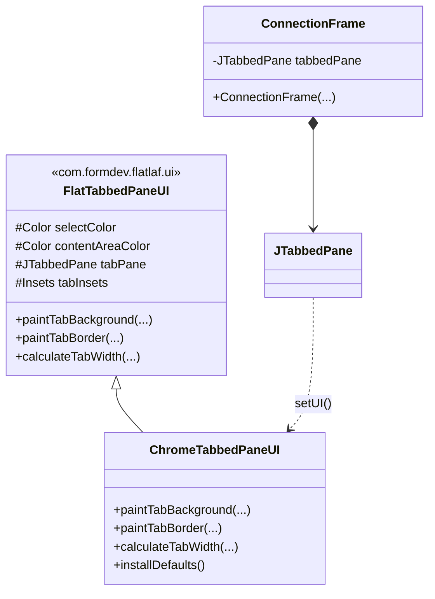

# Chrome-ähnliche TabbedPane im ConnectionFrame

## Ziel

Das [`JTabbedPane`](src/main/java/de/in/jnc/connection/ConnectionFrame.java:127) im [`ConnectionFrame`](src/main/java/de/in/jnc/connection/ConnectionFrame.java) soll einen Chrome-ähnlichen Look erhalten — trapezförmige Tabs mit sanften Kurvenübergängen, anstatt der rechteckigen FlatLaf-Standard-Tabs.

---

## 1. Aktuelle Situation (Ist-Zustand)

- [`ConnectionFrame`](src/main/java/de/in/jnc/connection/ConnectionFrame.java) verwendet eine Standard-`JTabbedPane` (Zeile 127)
- FlatLaf ([`FlatDarkLaf`](src/main/java/de/in/jnc/App.java:45)) rendert die Tabs im typischen Flat-Style: rechteckig, flach, mit minimalen Abständen
- Es werden bereits einige FlatLaf-Client-Properties gesetzt:
  - [`JTabbedPane.leadingComponent`](src/main/java/de/in/jnc/connection/ConnectionFrame.java:187) — Web Apps Button
  - [`JTabbedPane.trailingComponent`](src/main/java/de/in/jnc/connection/ConnectionFrame.java:193) — "+" Button
- Die Tabs haben aktuell:
  - Tab 0: Terminal (icon-only, kein Text)
  - Tab 1: File Transfer (icon-only, kein Text)
  - Tab 2+: Browser Tabs (dynamisch, mit Text + Close-Button)

---

## 2. Soll-Konzept (Ziel-Architektur)

### 2.1 Neue Klasse: `ChromeTabbedPaneUI`

```
src/main/java/de/in/jnc/connection/ChromeTabbedPaneUI.java
```

**Basis-Klasse:** [`com.formdev.flatlaf.ui.FlatTabbedPaneUI`](https://github.com/JFormDesigner/FlatLaf/blob/main/flatlaf-core/src/main/java/com/formdev/flatlaf/ui/FlatTabbedPaneUI.java)

**Überschriebene Methoden:**

| Methode | Zweck |
|---------|-------|
| `paintTabBackground(Graphics, int, int, int, int, int, int, boolean)` | Zeichnet die Chrome-Trapezform mit Java2D `Path2D` |
| `paintTabBorder(Graphics, int, int, int, int, int, int, boolean)` | Wird deaktiviert (kein separater Border nötig) |
| `installDefaults()` | Setzt FlatLaf-spezifische defaults für Chrome-Look |
| `calculateTabWidth(int, int, FontMetrics)` | Reduziert Tab-Breite für engeren Chrome-Versatz und **begrenzt auf Maximum** (z. B. 220px) |

**Chrome-Geometrie (Path2D):**

```
       ┌──────────────────────┐
      ╱                        ╲
    ╱                            ╲
  ┌────────────────────────────────┐
```

- Linke obere Ecke: Start bei `(x, y+h)`, CurveTo nach `(x+slope, y)` — sanfter Anstieg
- Obere Kante: `lineTo(x+w-slope, y)` — gerade Linie
- Rechte obere Ecke: CurveTo nach `(x+w, y+h)` — sanfter Abstieg
- Untere Kante: `lineTo(x, y+h)` — schließt den Pfad
- `slope = h / 3` — steuert die Schrägung

### 2.2 Farbstrategie

| Zustand | Quelle | Beschreibung |
|---------|--------|-------------|
| **Selected** | Protected-Feld `selectColor` aus FlatTabbedPaneUI | Vom FlatLaf-Theme bestimmte Akzentfarbe |
| **Unselected** | `tabPane.getBackground()` | Helleres/transparenteres Grau |
| **Hover** | (optional) Leichte Aufhellung via `tabPane.getBackground().brighter()` | Für später, wenn gewünscht |

### 2.3 Integration in ConnectionFrame

Anpassungen in [`ConnectionFrame.java`](src/main/java/de/in/jnc/connection/ConnectionFrame.java):

1. **Custom UI setzen** nach Erzeugung der `tabbedPane` (Zeile 127):
   ```java
   tabbedPane.setUI(new ChromeTabbedPaneUI());
   ```

2. **FlatLaf Client Properties** setzen:
   ```java
   tabbedPane.putClientProperty("JTabbedPane.showTabSeparators", Boolean.FALSE);
   tabbedPane.putClientProperty("JTabbedPane.hasFullBorder", Boolean.FALSE);
   tabbedPane.putClientProperty("JTabbedPane.minimumTabHeight", 32);
   tabbedPane.putClientProperty("JTabbedPane.tabHeight", 32);  // falls von FlatLaf unterstützt
   tabbedPane.putClientProperty("JTabbedPane.tabAreaInsets", new Insets(2, 2, 0, 2));
   ```

3. **Tab-Layout überprüfen** — die icon-only Tabs (Terminal, File Transfer) behalten ihre Icons, Browser-Tabs haben Text + Close-Button.

### 2.4 Max-Tab-Breite (Chrome-Verhalten)

Chrome begrenzt die Tab-Breite, damit viele Tabs nebeneinander passen. In der aktuellen Implementierung wachsen Tabs unbegrenzt mit dem Titel-Text.

**Lösung in `ChromeTabbedPaneUI`:**
- `calculateTabWidth()` gibt `Math.min(super.berechnung, MAX_TAB_WIDTH)` zurück — betrifft Standard-Tabs (icon-only Terminal + File Transfer)

**Lösung in `BrowserTabManager`:**
- Die custom Tab-Komponente (JPanel in `installTabCloseButton`) überschreibt `getPreferredSize()`, um die Maximalbreite zu capen
- Der `JLabel` erhält einen Tooltip mit dem vollständigen Titel (siehe 2.5)

### 2.5 Tooltip bei langen Titeln (Chrome-Verhalten)

Chrome zeigt beim Hovern über einen Tab einen Tooltip mit dem vollständigen Seitentitel an, wenn der Titel im Tab abgeschnitten ist.

**Lösung in `BrowserTabManager.installTabCloseButton()`:**
- Setzt auf dem `JLabel` (Tab-Titel) immer einen Tooltip (`label.setToolTipText(title)`)
- Der Tooltip wird aktualisiert, wenn sich der Titel ändert (`onTitleChanged`)
- Keine Vorschau, nur der reine Text — wie gewünscht

---

## 3. Detaillierte Implementierungsschritte

### Schritt 1: `ChromeTabbedPaneUI.java` erstellen

**Paket:** `de.in.jnc.connection` (neben `ConnectionFrame`)

**Kern-Implementierung:**

```java
package de.in.jnc.connection;

import com.formdev.flatlaf.ui.FlatTabbedPaneUI;
import javax.swing.*;
import javax.swing.plaf.ComponentUI;
import java.awt.*;
import java.awt.geom.Path2D;

public class ChromeTabbedPaneUI extends FlatTabbedPaneUI {

    public static ComponentUI createUI(JComponent c) {
        return new ChromeTabbedPaneUI();
    }

    @Override
    protected void installDefaults() {
        super.installDefaults();
        // Chrome-spezifische Defaults
        tabInsets = new Insets(8, 12, 8, 12);
        selectedTabPadInsets = new Insets(0, 0, 0, 0);
    }

    @Override
    protected void paintTabBackground(Graphics g, int tabPlacement, int tabIndex,
                                      int x, int y, int w, int h, boolean isSelected) {
        Graphics2D g2 = (Graphics2D) g.create();
        try {
            g2.setRenderingHint(RenderingHints.KEY_ANTIALIASING, 
                                RenderingHints.VALUE_ANTIALIAS_ON);

            // Farbe bestimmen
            Color bg = isSelected ? selectColor : tabPane.getBackground();
            // Aufhellung für unselected tabs, damit sie sich vom Hintergrund abheben
            if (!isSelected) {
                bg = new Color(
                    Math.min(255, bg.getRed() + 20),
                    Math.min(255, bg.getGreen() + 20),
                    Math.min(255, bg.getBlue() + 20),
                    bg.getAlpha()
                );
            }
            g2.setColor(bg);

            // Chrome-Trapezform via Path2D
            Path2D.Float path = new Path2D.Float();
            float slope = Math.min(h * 0.35f, 18f); // Schräge, gedeckelt

            path.moveTo(x, y + h);                      // unten links
            path.curveTo(x + slope * 0.5f, y + h,       // Kontrollpunkt 1
                         x + slope * 0.5f, y,           // Kontrollpunkt 2
                         x + slope, y);                 // end: oben links
            path.lineTo(x + w - slope, y);               // oben rechts (gerade)
            path.curveTo(x + w - slope * 0.5f, y,        // Kontrollpunkt 1
                         x + w - slope * 0.5f, y + h,    // Kontrollpunkt 2
                         x + w, y + h);                  // end: unten rechts
            path.closePath();

            g2.fill(path);

            // Leichte Umrandung für nicht-selektierte Tabs
            if (!isSelected) {
                g2.setColor(contentAreaColor);
                g2.setStroke(new BasicStroke(0.5f));
                g2.draw(path);
            }
        } finally {
            g2.dispose();
        }
    }

    @Override
    protected void paintTabBorder(Graphics g, int tabPlacement, int tabIndex,
                                  int x, int y, int w, int h, boolean isSelected) {
        // Kein separater Border — die Form in paintTabBackground reicht aus
    }

    /** Maximale Tab-Breite (wie Chrome: ~220px bei normaler Schrift) */
    private static final int MAX_TAB_WIDTH = 220;

    @Override
    protected int calculateTabWidth(int tabPlacement, int tabIndex, FontMetrics metrics) {
        int width = super.calculateTabWidth(tabPlacement, tabIndex, metrics);
        // Leicht reduzierte Breite für Chrome-Overlap-Effekt + Max-Begrenzung
        return Math.min(width - 4, MAX_TAB_WIDTH);
    }
}
```

**Wichtige FlatLab-Felder (protected, aus FlatTabbedPaneUI geerbt):**

| Feld | Typ | Beschreibung |
|------|-----|-------------|
| `selectColor` | `Color` | Hintergrundfarbe des selektierten Tabs |
| `contentAreaColor` | `Color` | Randfarbe des Content-Bereichs |
| `tabPane` | `JTabbedPane` | Referenz auf die zugehörige TabbedPane |

### Schritt 2: ConnectionFrame anpassen

In [`ConnectionFrame.java`](src/main/java/de/in/jnc/connection/ConnectionFrame.java):

1. Import hinzufügen: `import de.in.jnc.connection.ChromeTabbedPaneUI;`
2. Nach `tabbedPane = new JTabbedPane();` (Zeile 127) einfügen:
   ```java
   tabbedPane.setUI(new ChromeTabbedPaneUI());
   ```
3. Client Properties ergänzen (z.B. nach Zeile 127, vor den Tab-Hinzufügungen):
   ```java
   tabbedPane.putClientProperty("JTabbedPane.showTabSeparators", Boolean.FALSE);
   tabbedPane.putClientProperty("JTabbedPane.hasFullBorder", Boolean.FALSE);
   tabbedPane.putClientProperty("JTabbedPane.minimumTabHeight", 32);
   tabbedPane.putClientProperty("JTabbedPane.tabHeight", 32);
   ```

### Schritt 3: BrowserTabManager anpassen (Tooltip & Max-Breite)

In [`BrowserTabManager.java`](src/main/java/de/in/jnc/connection/browser/BrowserTabManager.java):

**`installTabCloseButton()` ändern:**
- Das `JLabel` erhält `setToolTipText(title)` — zeigt den vollständigen Titel beim Hovern
- Das `JPanel` überschreibt `getPreferredSize()`, um die Breite auf die Maximalbreite zu capen:

```java
private void installTabCloseButton(int tabIndex, String title, BrowserPanel panel) {
    JPanel tabComponent = new JPanel(new FlowLayout(FlowLayout.LEFT, 2, 0)) {
        @Override
        public Dimension getPreferredSize() {
            Dimension pref = super.getPreferredSize();
            pref.width = Math.min(pref.width, ChromeTabbedPaneUI.MAX_TAB_WIDTH);
            return pref;
        }
    };
    tabComponent.setOpaque(false);
    JLabel label = new JLabel(title);
    label.setToolTipText(title);  // Tooltip für langen Titel
    tabComponent.add(label);
    // ... rest (Close-Button) bleibt unverändert
}
```

**`onTitleChanged()` aktualisieren:**
- Wenn der Titel geändert wird, auch den Tooltip des `JLabel` aktualisieren:

```java
private void onTitleChanged(BrowserPanel panel, String title) {
    int index = tabbedPane.indexOfComponent(panel);
    if (index >= 0 && title != null && !title.isEmpty()) {
        tabbedPane.setTitleAt(index, title);
        Component tabComp = tabbedPane.getTabComponentAt(index);
        if (tabComp instanceof JPanel panelWithLabel) {
            for (Component child : panelWithLabel.getComponents()) {
                if (child instanceof JLabel label) {
                    label.setText(title);
                    label.setToolTipText(title);  // Tooltip aktualisieren
                    break;
                }
            }
        }
    }
}
```

**Import ergänzen:**
```java
import javax.swing.JLabel;
```
(benötigt, falls nicht bereits vorhanden)

### Schritt 4: Kompilieren & Visuelle Verifikation

- `mvn compile -q` ausführen (via Terminal im Code-Mode)
- Bei Fehlern: FlatLaf-API-Kompatibilität prüfen (`selectColor`, `contentAreaColor` existieren in FlatLaf 3.7.1?)
- App starten: `mvn exec:java`
- Visuell prüfen:
  - Selektierte Tabs haben Chrome-Form
  - Unselektierte Tabs haben dezente Umrandung
  - Übergang zum Content-Bereich ist sauber
  - Icon-only Tabs (Terminal, File Transfer) sehen gut aus
  - Browser Tabs mit Close-Button sind ebenfalls korrekt

---

## 4. Mögliche Probleme & Lösungen

### 4.1 `selectColor` / `contentAreaColor` sind null oder nicht zugänglich

**Lösung:** Eigene Default-Farben definieren, falls die Felder null sind:
```java
Color selectCol = selectColor != null ? selectColor : UIManager.getColor("TabbedPane.selectedBackground");
```

### 4.2 Tab-Inhalt wird von der Chrome-Form abgeschnitten

**Lösung:** `tabInsets` anpassen — weniger Padding oben (die Kurve "frisst" Platz):
```java
tabInsets = new Insets(6, 14, 8, 14);
```

### 4.3 Tooltip wird nicht angezeigt bei custom Tab-Komponente

**Lösung:** Der Tooltip muss auf dem `JLabel` innerhalb der custom Tab-Komponente gesetzt werden, nicht auf dem Tab selbst (`tabbedPane.setToolTipTextAt()` funktioniert nicht zuverlässig bei custom Komponenten).

### 4.4 Der untere Rand der Tabs (Content-Bereich) hat eine scharfe Kante

**Lösung:** Optional `paintContentBorder` überschreiben, um einen weichen Übergang zu zeichnen.

### 4.5 Tab-Overlap (Chrome-typisch)

**Lösung:** `calculateTabWidth` gibt `super - 4` zurück. Zusätzlich in `paintTabBackground` die x-Position um 2-3px nach links verschieben für Overlap-Effekt.

### 4.6 Probleme mit BrowserTabManager (dynamic tabs)

Der [`BrowserTabManager`](src/main/java/de/in/jnc/connection/browser/BrowserTabManager.java) fügt dynamisch Tabs hinzu/entfernt. Die Custom UI sollte dies ohne Anpassung unterstützen, da sie auf Ebene des `JTabbedPane`-UI-Delegats arbeitet.

---

## 5. Klassendiagramm



---

## 6. Abgrenzung / Nicht enthalten

- **Kein Tab-Drag & Drop** — wird nicht implementiert
- **Kein Tab-Hover-Farbwechsel** — kann später ergänzt werden
- **Kein Tabs-Schließen-Button-Stil** — bleibt bei FlatLaf-Standard
- **BrowserTabManager-Änderungen** — Tooltip-Support + Max-Breite in custom Tab-Komponente

---

## 7. Geänderte Dateien (Übersicht)

| Datei | Änderung |
|-------|----------|
| [`src/main/java/de/in/jnc/connection/ChromeTabbedPaneUI.java`](src/main/java/de/in/jnc/connection/ChromeTabbedPaneUI.java) | **Neu** — Chrome-Tab-Painter mit Max-Breite |
| [`src/main/java/de/in/jnc/connection/ConnectionFrame.java`](src/main/java/de/in/jnc/connection/ConnectionFrame.java) | Custom UI setzen + Client Properties |
| [`src/main/java/de/in/jnc/connection/browser/BrowserTabManager.java`](src/main/java/de/in/jnc/connection/browser/BrowserTabManager.java) | Tooltip + Max-Breite in `installTabCloseButton` und `onTitleChanged` |

---

## 8. Testplan

| Testfall | Erwartung |
|----------|-----------|
| App starten, Connection öffnen | 3 Tabs (Terminal, File Transfer, ggf. Browser) mit Chrome-Form |
| Tab-Selektion wechseln | Selektierter Tab hebt sich farblich ab |
| Neuen Browser-Tab öffnen ("+" Button) | Neuer Tab erscheint mit Chrome-Form |
| Browser-Tab schließen | Tab verschwindet sauber |
| **Maximale Tab-Breite** | Tab wird nie breiter als ~220px, auch bei langen Titeln |
| **Tooltip bei langen Titeln** | Hover über Tab (JLabel) zeigt Tooltip mit vollständigem Titel |
| Browser-Seite navigieren | Tab-Titel und Tooltip werden aktualisiert (via `onTitleChanged`) |
| FlatLaf Theme-Wechsel (Dark/Light) | Farben passen sich an (selectColor aus Theme) |
| Fenster-Größe ändern | Tabs rendern sauber neu, keine Artefakte |
| Viele Browser-Tabs öffnen (>10) | Kein übermäßiges Breitenwachstum durch Max-Breite |
