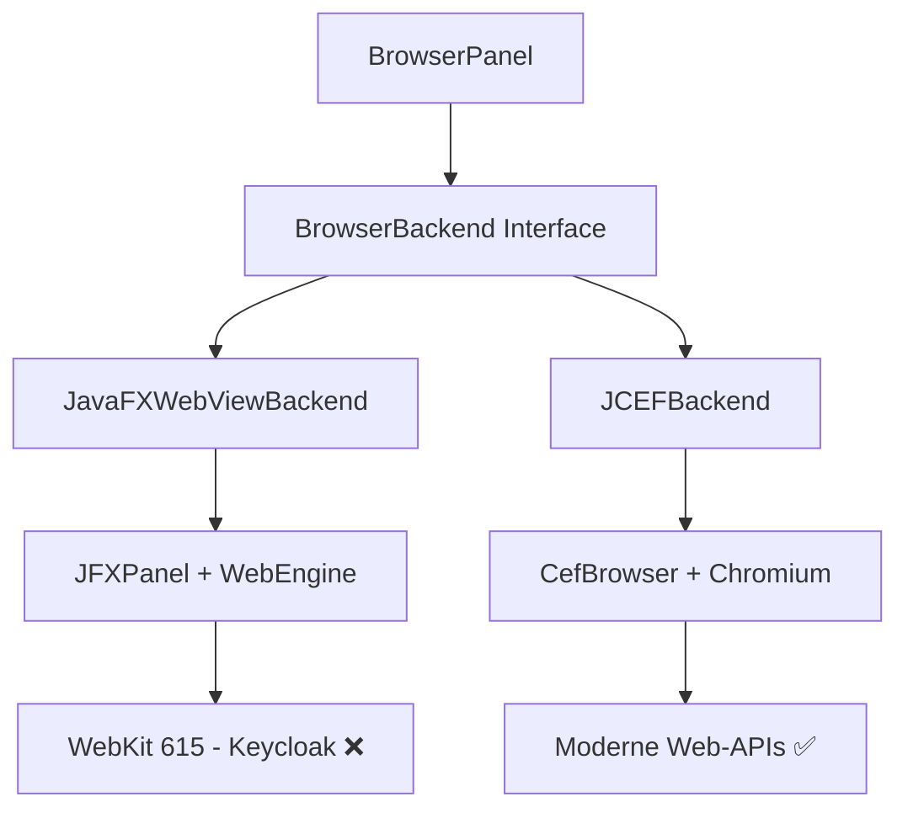

# Keycloak Admin Console vs. JavaFX WebEngine — Analyse & Handlungsempfehlung

## Diagnose: Ja, die JavaFX WebEngine kann Keycloak nicht rendern

Deine Recherche ist korrekt. Die JavaFX WebEngine ist technisch nicht in der Lage, die Keycloak Admin Console darzustellen. Der "Loading the admin console"-Screen ist das klassische Symptom.

---

## Technische Ursachenanalyse

### 1. Die WebKit-Version in JavaFX 21 ist zu alt

| Komponente | Version |
|---|---|
| **JavaFX** | 21 (definiert in [`pom.xml`](pom.xml:14)) |
| **WebKit (in JavaFX 21)** | ~615.1 |
| **Letztes WebKit-Update für JavaFX** | ca. 2021 |

JavaFX verwendet einen **eingefrorenen WebKit-Fork**, der nur noch Security-Patches erhält, aber **keine neuen Web-Features**. Das JavaFX-Team hat das WebKit-Upgrade faktisch eingestellt — die Engine ist auf dem Stand von ~2021.

### 2. Was die Keycloak Admin Console benötigt (und was fehlt)

Die Keycloak Admin Console (seit Keycloak 17+) ist eine **React-basierte SPA** (Single Page Application), die folgende moderne Web-APIs benötigt:

| Feature | Von Keycloak benötigt | JavaFX WebKit 615 | 
|---|---|---|
| **ES Modules** (`import`/`export`) | ✅ Ja | ❌ **Nicht unterstützt** |
| **Dynamic `import()`** | ✅ Ja | ❌ **Nicht unterstützt** |
| **`fetch()` API** | ✅ Ja | ⚠️ Teilweise (buggy) |
| **CSS Custom Properties** | ✅ Ja | ⚠️ Teilweise |
| **CSS Grid Layout** | ✅ Ja | ⚠️ Teilweise |
| **Service Workers** | Optional | ❌ **Nicht unterstützt** |
| **WebSocket** | Ja (Auth Flow) | ⚠️ Buggy |
| **ES2020+ Syntax** | ✅ Ja | ❌ **Nicht unterstützt** |

Der entscheidende Punkt: **Keycloaks JavaScript-Bundle verwendet ES-Module und dynamische Imports**, die die JavaFX-WebEngine schlicht nicht parsen kann. Das Bundle schlägt beim Laden fehl, die React-App wird nie initialisiert, und der "Loading the admin console"-Spinner läuft ewig.

### 3. Warum kein Workaround existiert

- **Kein Polyfill möglich**: ES-Module (`import`/`export`) sind ein Parsing-Level-Feature der JavaScript-Engine. Sie können nicht per Polyfill nachgerüstet werden, weil der Parser das `import`-Keyword nicht versteht.
- **Kein WebKit-Upgrade möglich**: JavaFX-WebKit ist tief in die JavaFX-Runtime integriert. Ein Austausch der WebKit-Version ist nicht vorgesehen.
- **Kein Keycloak-Legacy-Mode**: Keycloak bietet keinen "No-JS"-Fallback oder ein Legacy-Bundle für alte Browser an.

---

## Aktueller Projektstatus

### Was bereits implementiert ist (→ Code ist produktiv)

Euer Projekt hat bereits eine **vollständige Zwei-Backend-Architektur**:



**Implementierte, produktive Dateien:**

| Datei | Status |
|---|---|
| [`BrowserBackend.java`](src/main/java/de/in/jnc/connection/browser/backend/BrowserBackend.java) | ✅ Interface definiert |
| [`BrowserBackendType.java`](src/main/java/de/in/jnc/connection/browser/backend/BrowserBackendType.java) | ✅ Enum (JAVAFX_WEBVIEW, JCEF) |
| [`JavaFXWebViewBackend.java`](src/main/java/de/in/jnc/connection/browser/backend/JavaFXWebViewBackend.java) | ✅ Vollständig (534 Zeilen) |
| [`JCEFBackend.java`](src/main/java/de/in/jnc/connection/browser/backend/jcef/JCEFBackend.java) | ✅ Vollständig (373 Zeilen) |
| [`JCEFInitializer.java`](src/main/java/de/in/jnc/connection/browser/backend/jcef/JCEFInitializer.java) | ✅ Lazy CefApp-Startup |
| [`BrowserPanel.java`](src/main/java/de/in/jnc/connection/browser/BrowserPanel.java) | ✅ Unterstützt Backend-Wechsel |
| [`SslCertInfo.java`](src/main/java/de/in/jnc/connection/browser/backend/SslCertInfo.java) | ✅ Backend-agnostische Zertifikatsinfo |
| Maven Dependency `me.friwi:jcefmaven:146.0.10` | ✅ In [`pom.xml`](pom.xml:111-115) |
| [`JCEFDebugTest.java`](src/test/java/de/in/jnc/connection/browser/JCEFDebugTest.java) | ✅ Manueller Test |

### Der Haken: JCEF wird nicht als Default verwendet

In [`BrowserPanel.java`](src/main/java/de/in/jnc/connection/browser/BrowserPanel.java:143) wird standardmäßig `BrowserBackendType.JAVAFX_WEBVIEW` verwendet:

```java
public BrowserPanel(String url) {
    this(url, BrowserBackendType.JAVAFX_WEBVIEW);  // ← Zeile 144
}
```

**Das bedeutet:** Jeder neue Browser-Tab startet mit JavaFX WebView — und kann Keycloak nicht laden.

---

## Handlungsempfehlung

### Sofort-Maßnahme: JCEF zum Default für neue Tabs machen

Der minimale Fix — **Änderung einer Zeile** in [`BrowserPanel.java`](src/main/java/de/in/jnc/connection/browser/BrowserPanel.java:144):

```java
// VORHER:
public BrowserPanel(String url) {
    this(url, BrowserBackendType.JAVAFX_WEBVIEW);
}

// NACHHER (Option A — JCEF als Default):
public BrowserPanel(String url) {
    this(url, BrowserBackendType.JCEF);
}
```

ODER intelligenter: Default aus `GlobalSettings` auflösen (bereits im Epic-5-Plan vorgesehen):

```java
public BrowserPanel(String url) {
    this(url, GlobalSettings.getInstance().getDefaultBrowser());
}
```

### Vollständige Epic-5-Umsetzung (restliche Stories)

Die Stories 5.1 und 5.2 sind bereits implementiert. Es fehlen:

1. **Story 5.3 — Backend Switching UI**
   - `GlobalSettings.defaultBrowser` mit Settings-Dialog
   - `ConnectionProfile.browserBackend` (optionales Override)
   - "Browser wechseln"-Eintrag im Kontextmenü
   - Resolve-Logik: Profil → Global → Default

2. **Story 5.4 — CertificateStoreManager für JCEF** (größtenteils vorhanden)
   - `loadCertificatesFromDirectory()` / `isKnown()` für PEM-Cache

3. **Story 5.5 — Native Build & Distribution**
   - Natives-ZIP in `resources/` bündeln
   - `extractNatives()` für First-Run

---

## Nächste Schritte

1. **JCEF-Natives-Test:** Funktioniert der JCEF-Backend-Test?
   ```
   mvn test "-Dtest=JCEFDebugTest"
   ```
   Oder manuell:
   ```
   mvn exec:java "-Dexec.mainClass=de.in.jnc.connection.browser.JCEFDebugTest"
   ```

2. **Keycloak-Test mit JCEF:** Den `JCEFDebugTest` gegen `https://tbs10-plat1/auth` laufen lassen und prüfen, ob die Admin Console lädt.

3. **Default-Änderung:** `BrowserPanel` auf JCEF umstellen ODER `GlobalSettings.defaultBrowser` implementieren.

4. **Backlog aktualisieren:** Stories 5.1 und 5.2 als erledigt markieren.
